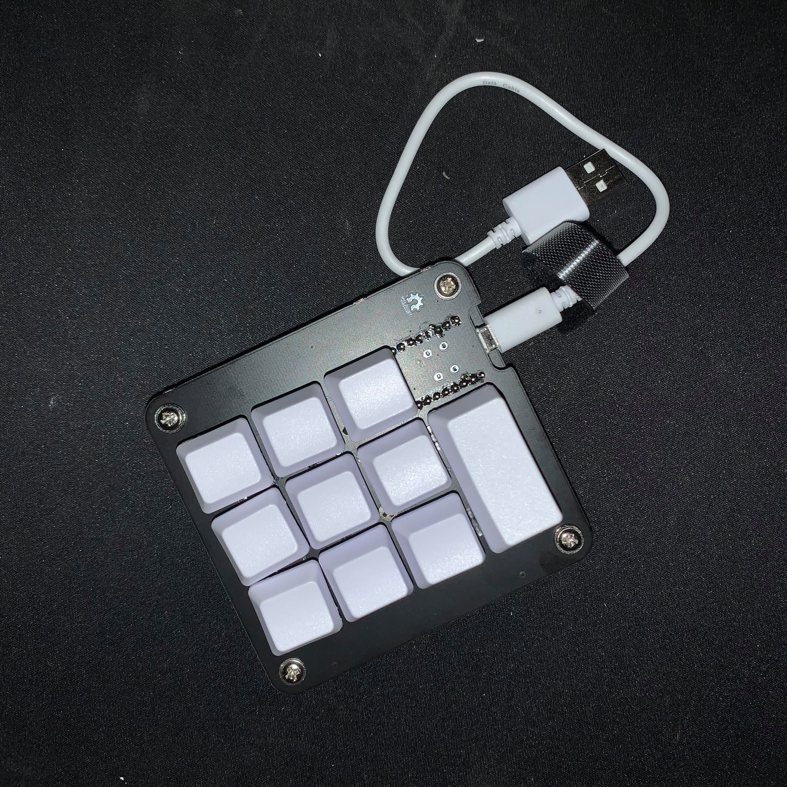
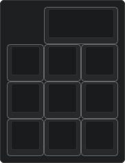
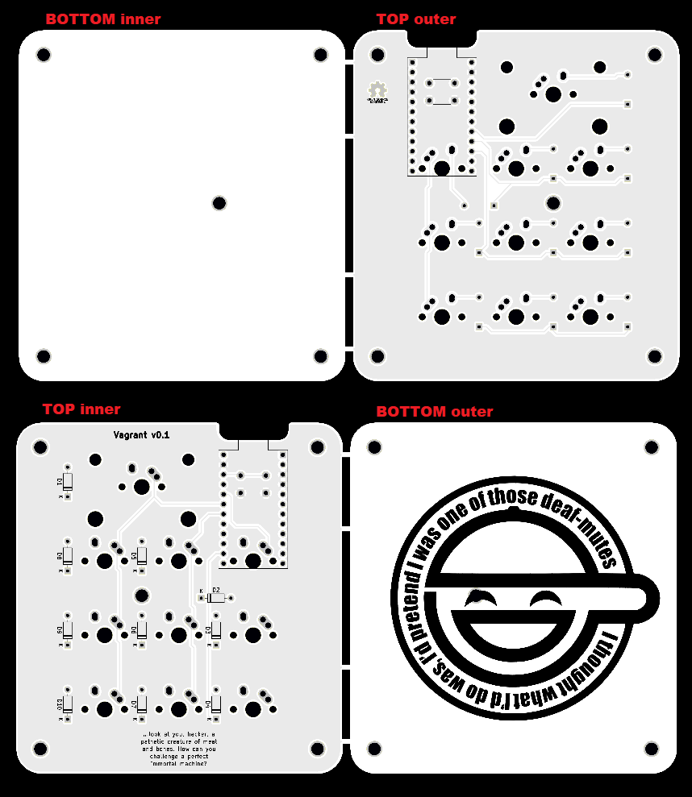

# Vagrant-10

PCB for small, 10-key macropad. Compatible with **MX-style** and **Alps** switches.

## Firmware

You can find precompiled firmware inside [pc-firmware](https://github.com/Sho-Keebs/Vagrant-10/blob/master/pc-firmware/) directory or compile it from [QMK](https://github.com/qmk/qmk_firmware). It is available to configure in [QMK Configurator](https://config.qmk.fm/#/vagrant_10/LAYOUT)!

## Layout

## PCB

## Build guide

I suggest using [PyrooL's Aplpha build guide](https://github.com/PyrooL/Alpha) as those keyboards are built with the same components.